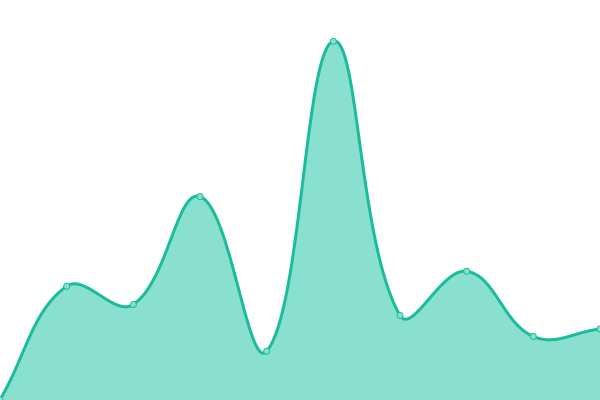
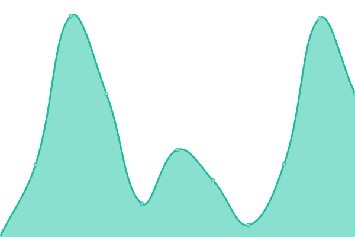
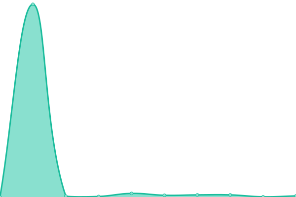
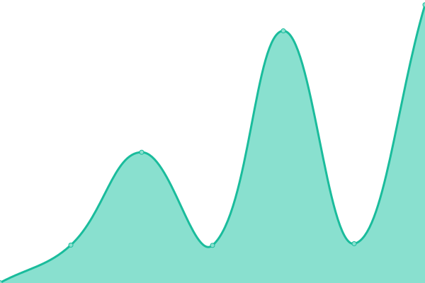

# [📈 Live Status](https://jolg42.github.io/upptime): <!--live status--> **🟩 All systems operational**

This repository contains the open-source uptime monitor and status page for [Joël Galeran](https://twitter.com/Jolg42), powered by [Upptime](https://github.com/upptime/upptime).

With [Upptime](https://upptime.js.org), you can get your own unlimited and free uptime monitor and status page, powered entirely by a GitHub repository. We use [Issues](https://github.com/jolg42/upptime/issues) as incident reports, [Actions](https://github.com/jolg42/upptime/actions) as uptime monitors, and [Pages](https://jolg42.github.io/upptime) for the status page.

<!--start: status pages-->
<!-- This summary is generated by Upptime (https://github.com/upptime/upptime) -->
<!-- Do not edit this manually, your changes will be overwritten -->
<!-- prettier-ignore -->
| URL | Status | History | Response Time | Uptime |
| --- | ------ | ------- | ------------- | ------ |
| [Prisma](https://www.prisma.io) | 🟩 Up | [prisma.yml](https://github.com/Jolg42/upptime/commits/master/history/prisma.yml) | 

 804ms
     
 | 

   

| [Prisma Blog](https://www.prisma.io/blog/) | 🟩 Up | [prisma-blog.yml](https://github.com/Jolg42/upptime/commits/master/history/prisma-blog.yml) | 

 967ms
     
 | 

   

| [Prisma Docs](https://www.prisma.io/docs/) | 🟩 Up | [prisma-docs.yml](https://github.com/Jolg42/upptime/commits/master/history/prisma-docs.yml) | 

 911ms
     
 | 

   

| [Prisma Dataguide](https://www.prisma.io/dataguide/) | 🟩 Up | [prisma-dataguide.yml](https://github.com/Jolg42/upptime/commits/master/history/prisma-dataguide.yml) | 

 723ms
     
 | 

   

| [HowToGraphql](https://www.howtographql.com/) | 🟩 Up | [how-to-graphql.yml](https://github.com/Jolg42/upptime/commits/master/history/how-to-graphql.yml) | 

 582ms
     
 | 

   

<!--end: status pages-->

[**Visit our status website →**](https://jolg42.github.io/upptime)

## 📄 License

- Code: [MIT](./LICENSE) © [Joël Galeran](https://twitter.com/Jolg42)
- Data in the `./history` directory: [Open Database License](https://opendatacommons.org/licenses/odbl/1-0/)
