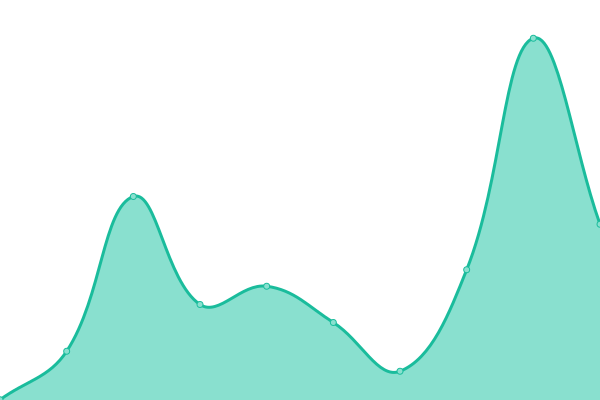
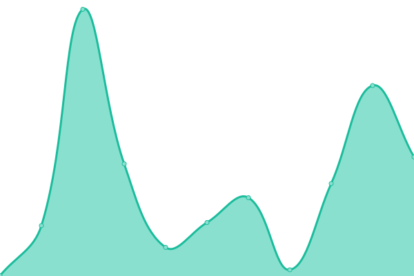
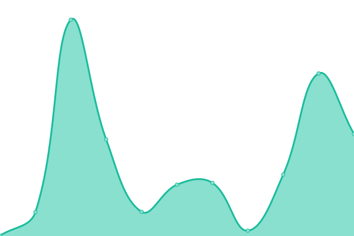

# [📈 Live Status](https://jolg42.github.io/upptime): <!--live status--> **🟩 All systems operational**

This repository contains the open-source uptime monitor and status page for [Joël Galeran](https://twitter.com/Jolg42), powered by [Upptime](https://github.com/upptime/upptime).

With [Upptime](https://upptime.js.org), you can get your own unlimited and free uptime monitor and status page, powered entirely by a GitHub repository. We use [Issues](https://github.com/jolg42/upptime/issues) as incident reports, [Actions](https://github.com/jolg42/upptime/actions) as uptime monitors, and [Pages](https://jolg42.github.io/upptime) for the status page.

<!--start: status pages-->
<!-- This summary is generated by Upptime (https://github.com/upptime/upptime) -->
<!-- Do not edit this manually, your changes will be overwritten -->

| URL                                                  | Status | History                                                                                               | Response Time                                                                         | Uptime                                                                                                                                                                                                                         |
| ---------------------------------------------------- | ------ | ----------------------------------------------------------------------------------------------------- | ------------------------------------------------------------------------------------- | ------------------------------------------------------------------------------------------------------------------------------------------------------------------------------------------------------------------------------ |
| [Prisma](https://www.prisma.io)                      | 🟩 Up  | [prisma.yml](https://github.com/Jolg42/upptime/commits/master/history/prisma.yml)                     |  901ms           |                      |
| [Prisma Blog](https://www.prisma.io/blog/)           | 🟩 Up  | [prisma-blog.yml](https://github.com/Jolg42/upptime/commits/master/history/prisma-blog.yml)           |  1356ms     |            |
| [Prisma Docs](https://www.prisma.io/docs/)           | 🟩 Up  | [prisma-docs.yml](https://github.com/Jolg42/upptime/commits/master/history/prisma-docs.yml)           |  1270ms     |            |
| [Prisma Dataguide](https://www.prisma.io/dataguide/) | 🟩 Up  | [prisma-dataguide.yml](https://github.com/Jolg42/upptime/commits/master/history/prisma-dataguide.yml) |  984ms |  |
| [HowToGraphql](https://www.howtographql.com/)        | 🟩 Up  | [how-to-graphql.yml](https://github.com/Jolg42/upptime/commits/master/history/how-to-graphql.yml)     |  434ms   |       |

<!--end: status pages-->

[**Visit our status website →**](https://jolg42.github.io/upptime)

## 📄 License

- Code: [MIT](./LICENSE) © [Joël Galeran](https://twitter.com/Jolg42)
- Data in the `./history` directory: [Open Database License](https://opendatacommons.org/licenses/odbl/1-0/)
